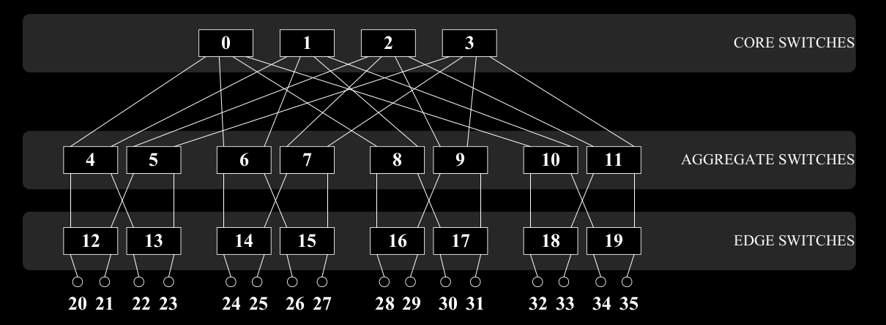

# In-Network Computing Simulator for Parallel Programming
This program is designed to simulate a parallel computing system based on fat-tree topology with in-network computing capability.



#### What is in-network computing?
An in-network computing capable system can perform tasks within the network infrastructure, rather than exclusively at the endpoints.

#### Why do we need it?
There are a couple of reasons behind this concept.
1. **Reduced Latency:** By processing data within the network, in-network computing can significantly reduce latency. This is because data does not need to travel back and forth between endpoints for processing.
2. **Bandwidth Efficiency:** It can optimize bandwidth usage by processing data locally, reducing the amount of data that needs to be transmitted across the network.
3. **Energy Efficiency:** By reducing the need for data to traverse long distances to centralized data centers, in-network computing can lead to energy savings, making it a more sustainable solution for large-scale data processing.

---
## Usage
Writing and building a custom parallel application within the simulator is described in this section. For now, it only supports Linux.

### Dependencies
The only external dependency of the program is [spdlog v1.15.0](https://github.com/gabime/spdlog/tree/v1.15.0) library which is used for logging events in the program.

```Bash
git clone --branch v1.15.0 https://github.com/gabime/spdlog.git &&
mkdir -p spdlog/build && cd spdlog/build &&
cmake -DSPDLOG_BUILD_SHARED=ON -DSPDLOG_ENABLE_PCH=ON -DSPDLOG_BUILD_EXAMPLE=OFF -DSPDLOG_INSTALL=ON -DSPDLOG_USE_STD_FORMAT=OFF .. &&
make -j all && sudo make install
```

#### Plotting the Results
You can also plot the results of the simulation using the script(s) provided in the `scripts` directory. The script is written in Python and uses the various packages for plotting. You can install its dependencies using the following command.

```Bash
sudo apt install python3 &&
sudo apt install python3-pip &&
pip install pandas &&
pip install matplotlib
```

### Implementing Custom Parallel Applications
The program is designed to ease migrations from traditional MPI-based programs. So, the programming interface is quite similar to that.
Just like you were writing a program using the MPI library, you need to write a program in the [`Computer::task(..)`](source/Computer.cpp) function.

#### Example Program
Below is an example program in which node #7 sends an array to node #12.

```C++
void Computer::task()
{
    spdlog::trace("Computer({}): Task started..", m_ID);

    if(7 == m_ID) {
        std::vector<float> data({1.0f, 2.0f, 3.0f, 4.0f, 5.0f});

        m_mpi.send(data, 12);
    }
    else if(12 == m_ID) {
        std::vector<float> data;
        m_mpi.receive(data, 7);

        spdlog::info("Computer({}): Received data from Computer(7):", m_ID);
        for(const auto &d : data) {
            spdlog::info("{}", d);
        }
    }
    else {
        // Do nothing
    }

    spdlog::warn("Computer({}): Task finished..", m_ID);
    m_bDone = true;
}
```

And the output for the program is as below. Note that the order of _task finished_ warnings might differ.

```shell
In_NetworkComputing: ./build/In_NetworkComputing

[2024-05-25 14:42:14.912] [info] Starting program..
[2024-05-25 14:42:14.912] [info] Network established successfully!
[2024-05-25 14:42:14.912] [warning] Computer(3): Task finished..
[2024-05-25 14:42:14.913] [warning] Computer(2): Task finished..
[2024-05-25 14:42:14.913] [warning] Computer(4): Task finished..
[2024-05-25 14:42:14.913] [warning] Computer(0): Task finished..
[2024-05-25 14:42:14.913] [warning] Computer(1): Task finished..
[2024-05-25 14:42:14.913] [warning] Computer(5): Task finished..
[2024-05-25 14:42:14.913] [warning] Computer(6): Task finished..
[2024-05-25 14:42:14.913] [warning] Computer(11): Task finished..
[2024-05-25 14:42:14.913] [warning] Computer(8): Task finished..
[2024-05-25 14:42:14.913] [warning] Computer(13): Task finished..
[2024-05-25 14:42:14.913] [warning] Computer(9): Task finished..
[2024-05-25 14:42:14.913] [warning] Computer(10): Task finished..
[2024-05-25 14:42:14.913] [warning] Computer(14): Task finished..
[2024-05-25 14:42:14.913] [warning] Computer(15): Task finished..
[2024-05-25 14:42:14.914] [info] Computer(12): Received data from Computer(7):
[2024-05-25 14:42:14.914] [info] 1
[2024-05-25 14:42:14.914] [info] 2
[2024-05-25 14:42:14.914] [info] 3
[2024-05-25 14:42:14.914] [info] 4
[2024-05-25 14:42:14.914] [info] 5
[2024-05-25 14:42:14.914] [warning] Computer(12): Task finished..
[2024-05-25 14:42:14.915] [warning] Computer(7): Task finished..
[2024-05-25 14:42:14.915] [info] All computing nodes have finished their tasks!
[2024-05-25 14:42:14.915] [warning] Program finished after 129 ticks!
```

---
## Design


## Implementation

